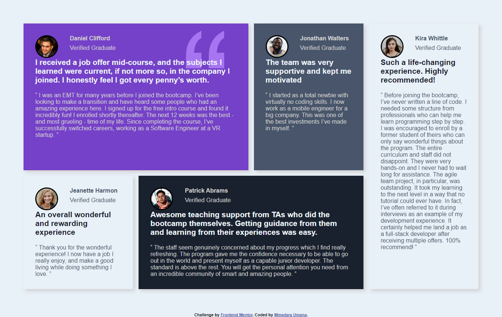

# Frontend Mentor - Testimonials grid section solution

This is a solution to the [Testimonials grid section challenge on Frontend Mentor](https://www.frontendmentor.io/challenges/testimonials-grid-section-Nnw6J7Un7). Frontend Mentor challenges help you improve your coding skills by building realistic projects. 

## Table of contents
- [Frontend Mentor - Testimonials grid section solution](#frontend-mentor---testimonials-grid-section-solution)
  - [Table of contents](#table-of-contents)
  - [Overview](#overview)
    - [Screenshot](#screenshot)
    - [Links](#links)
  - [My process](#my-process)
    - [Built with](#built-with)
    - [My experience](#my-experience)
    - [Continued development](#continued-development)
    - [Useful resources](#useful-resources)
  - [Author](#author)

## Overview

### Screenshot

### Links

- [Solution URL](https://www.frontendmentor.io/solutions/testimonials-grid-section-built-with-css-grid-0EOOxmEPEE)
- [Live Site URL](https://mmedarau.github.io/testimonials-grid/)

## My process

### Built with

- Semantic HTML5 markup
- Sass/SCSS
- Flexbox
- CSS Grid

### My experience
With this project, I wanted to practice working with CSS Grid. It's been a while since I worked with it or on any project actually. I had to take a break due to school and exams, but hopefully, I'll have time now.    
It was important for me to get back to coding by working on something a bit familiar instead of going head first to continue learning.

With this project, I stared with the content - arranging text, sizing the images, margins and paddings, etc - for both mobile and desktop view, before working on setting up the grid. 
When working on the grid, I started with the desktop view before the mobile view.

### Continued development

I'm interested in trying out animations and transitions with CSS in the future.

### Useful resources
Working on this project, I mostly looked back on my notes in the `cheatsheets` repository.  
However, the books that really helped learn CSS Grid are
- **Designing with CSS Grid Layout** by *Ahmad Ajmi, Nitish Kumar and Adrian Roworth*
 
- **Get Ready for CSS Grid Layout** by *Rachel Andrew*

## Author

- Hashnode - [Mmedara Umana](https://mmedaraumana.hashnode.dev/)
- Frontend Mentor - [@MmedaraU](https://www.frontendmentor.io/profile/MmedaraU)
- Twitter - [@MmedaraUmana](https://twitter.com/MmedaraUmana)
- Github - [MmedaraU](https://github.com/MmedaraU)
